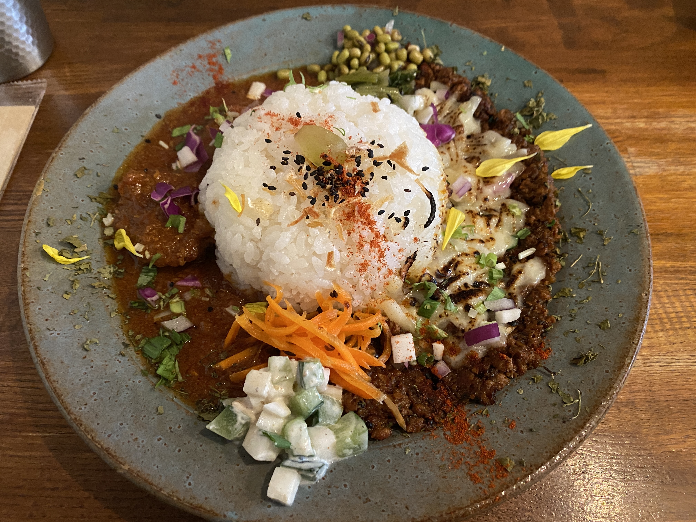
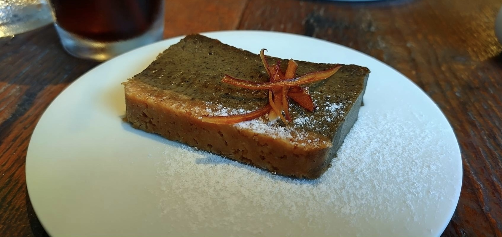
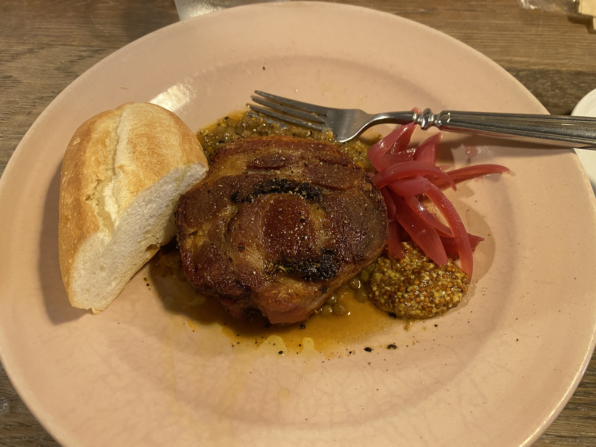
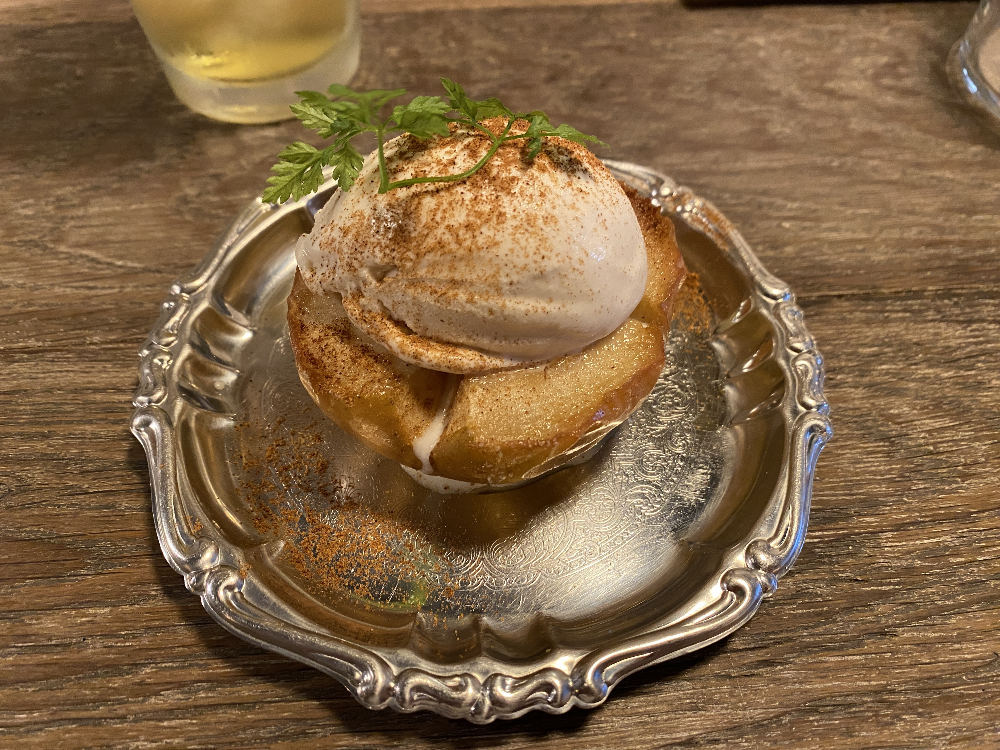
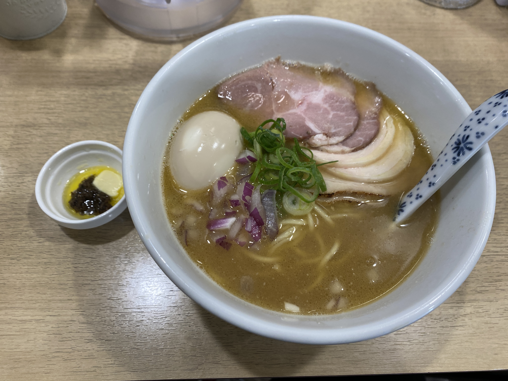

<!--
_class:
    - lead
    - invert
_footer: ""
_paginate: false
-->

# 2023

# 年末 LT 会

---

<!--
_class:
    - lead
    - invert
_footer: ""
_paginate: false
-->

## いつも技術の話しかしないので、今回は技術と関係のない話をします

---

<!--
_class:
    - lead
    - invert
_footer: ""
_paginate: false
-->

## 知っている方もいるかと思いますが

---

<!--
_class:
    - lead
    - invert
_footer: ""
_paginate: false
-->

## （夏頃に）下北沢に引っ越しました

---

<!--
_class:
    - lead
    - invert
_footer: ""
_paginate: false
-->

## そこで

---

<!--
_class:
    - lead
    - invert
_footer: ""
_paginate: false
-->

## 実際に行った店の中から、下北沢のおすすめの飲食店を紹介します！

---

# ラインナップ

- カレーの惑星
- 旧ヤム邸 シモキタ荘
- 胃袋にズキュン
- 下北沢ニカイノワインサカバ
- MOTHER
- 貝麺みかわ

---

# カレーの惑星

- 下北沢駅から徒歩 7 分
- スパイスカレーの店
- スパイシー焦がしキーマカレーが一番人気らしい
- 休みの日とかは結構人が並んでいる

---

<!--
_class:
    - lead
    - invert
_footer: ""
_paginate: false
-->

---

<!--
_class:
    - lead
    - invert
_footer: ""
_paginate: false
-->

---

# 旧ヤム邸 シモキタ荘

- 下北沢駅から徒歩 7 分
- 有名なスパイスカレーの店
- NHK のプロフェッショナルでも特集された
- 個性的なスパイスカレーを食べたい人におすすめ
- 休みの日とかは結構並ぶので、早めに行った方がいいかも

---

<!--
_class:
    - lead
    - invert
_footer: ""
_paginate: false
-->

---

# 胃袋にズキュン

- 下北沢駅から徒歩 5 分
- ビストロ、フレンチ
- こじんまりとした店で落ち着いた雰囲気
- どの料理もスイーツも美味しいのでおすすめ
- ランチも

---

<!--
_class:
    - lead
    - invert
_footer: ""
_paginate: false
-->

---

<!--
_class:
    - lead
    - invert
_footer: ""
_paginate: false
-->

---

<!--
_class:
    - lead
    - invert
_footer: ""
_paginate: false
-->

---

<!--
_class:
    - lead
    - invert
_footer: ""
_paginate: false
-->

---

<!--
_class:
    - lead
    - invert
_footer: ""
_paginate: false
-->

---

# 下北沢ニカイノワインサカバ

- 下北沢駅から徒歩 1 分
- カジュアルにワインと美味しい料理を味わえる
- どれも美味しい
- 駅前広場の目の前にあり、眺めも良い
- 飲み会の場所とかにいいかも

---

<!--
_class:
    - lead
    - invert
_footer: ""
_paginate: false
-->

---

<!--
_class:
    - lead
    - invert
_footer: ""
_paginate: false
-->

---

<!--
_class:
    - lead
    - invert
_footer: ""
_paginate: false
-->

---

<!--
_class:
    - lead
    - invert
_footer: ""
_paginate: false
-->

---

<!--
_class:
    - lead
    - invert
_footer: ""
_paginate: false
-->

---

# MOTHER

- 下北沢駅徒歩３分
- バー、ダイニングバー
- ディープな雰囲気を味わいたいときにおすすめ

---

<!--
_class:
    - lead
    - invert
_footer: ""
_paginate: false
-->

---

<!--
_class:
    - lead
    - invert
_footer: ""
_paginate: false
-->

---

# 貝麺みかわ

- 下北沢から徒歩 30 秒
- 個人的に一番好きなラーメン屋
- 既に 5 回くらい行った
- 貝の風味がすごい
- 毎月新作を出してくれるので飽きない

---

<!--
_class:
    - lead
    - invert
_footer: ""
_paginate: false
-->

---

<!--
_class:
    - lead
    - invert
_footer: ""
_paginate: false
-->

---

<!--
_class:
    - lead
    - invert
_footer: ""
_paginate: false
-->

# 特におすすめは

---

<!--
_class:
    - lead
    - invert
_footer: ""
_paginate: false
-->

# 貝麺みかわ

---

<!--
_class:
    - lead
    - invert
_footer: ""
_paginate: false
-->

# ぜひ行ってみてください！

---

# おわりに

- 下北沢に来て一人で食べるの寂しいと思ったらぜひ呼んでください
- 全部駅近で行きやすい
- 行ってみたいけど一人では、、というときはぜひ橋田を呼んでください
- いつでも行きます

---

<!--
_class:
    - lead
    - invert
_footer: ""
_paginate: false
-->

# よいお年を

---

<!--
backgroundColor: black
paginate: false
footer: ""
-->
