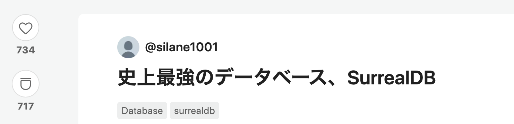
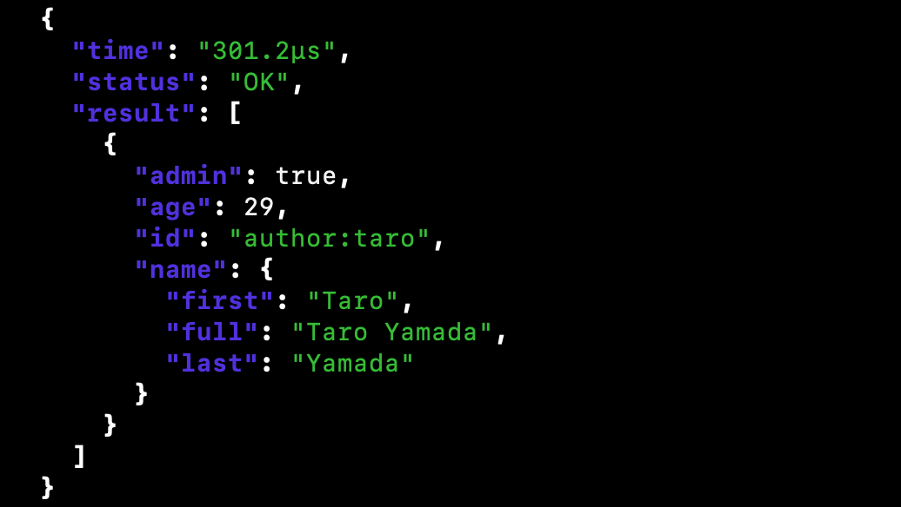
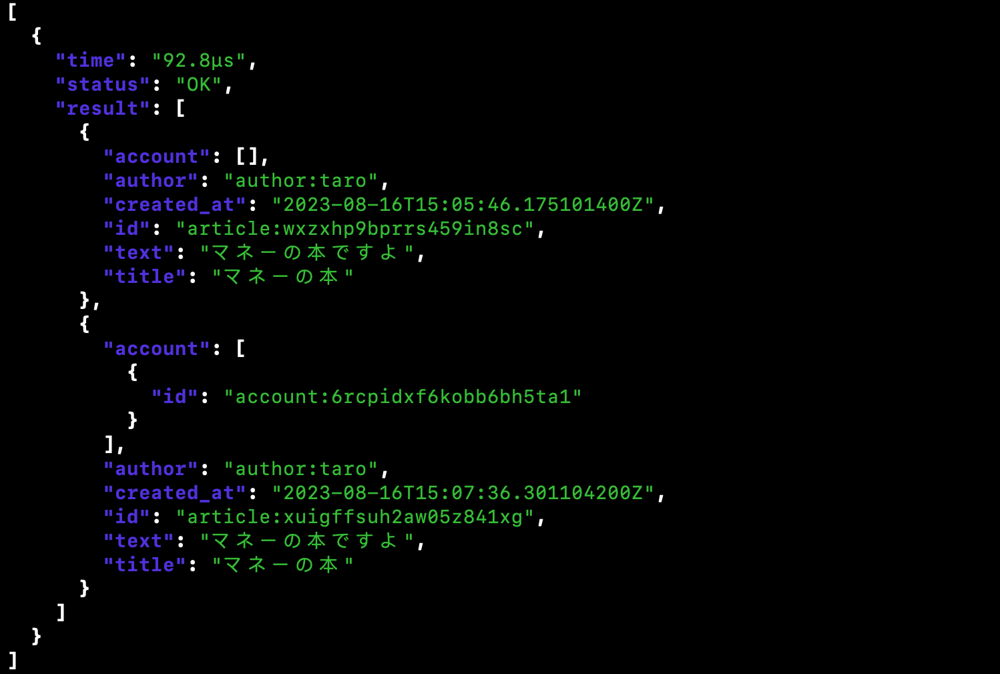
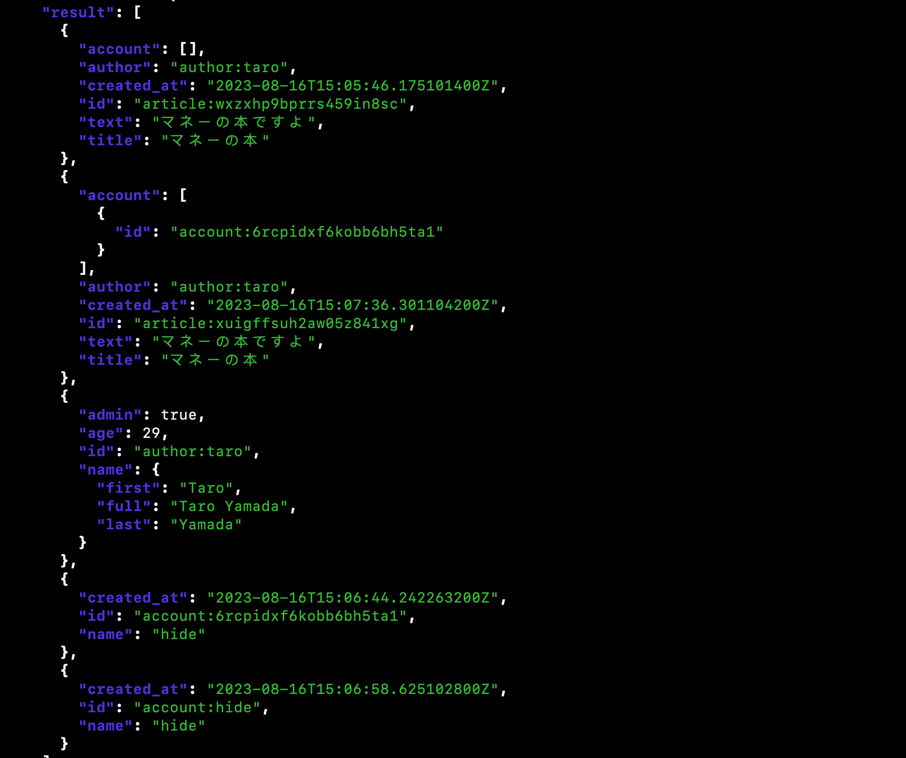
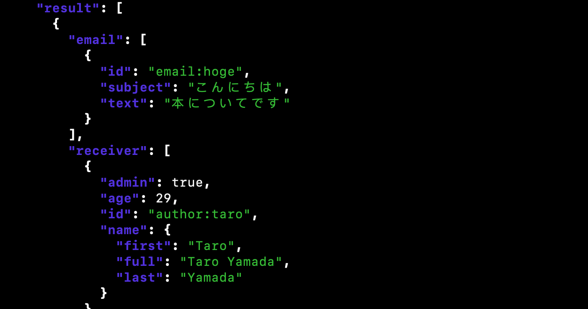

<!--
_class: lead
_footer: ""
_paginate: false
-->

# SurrealDB 触ってみた


---

# SurrealDB とは？

- 2022 年に登場した Rust 製のデータベース
- [史上最強のデータベース](https://qiita.com/silane1001/items/795c3539675e588c2c4d)らしい



---

# 特徴

- リレーショナル、ドキュメント、グラフ、あらゆる種類のデータ構造を扱える
- インメモリ、単一ノード、分散環境など様々な環境で動かせる
- HTTP、WebSocket、(GraphQL)など様々なアクセス方法に対応
- ユーザ認証、認可機能とが DB 本体に内包
- ブラウザから直に接続する WebDB としても使える
- SurrealQL という高機能な SQL に似た言語を採用
  - リレーションを簡単に定義できる

---

# つまり

なんでもできる

---

# 実際に触ってみた

## インストール

Docker で実行する場合は以下。

```
$ docker run --rm --pull always -p 8000:8000 surrealdb/surrealdb:latest start --user root --pass root
```

参考: https://surrealdb.com/docs/installation/running/docker

---

## レコードの追加

account テーブルとそのレコードを作成。

```sql
CREATE account
SET
  name = 'hide',
  created_at = time::now()
;
```

---

任意の id が登録される。
この id を使ってリレーション関係を指定したりする。


---

author テーブルとテーブルに含まれるレコードを作成する。

id を指定することも可能。（author:taro）（ターブル名:任意の値）

```sql
CREATE author:taro
SET
  name.first = 'Taro',
  name.last = 'Yamada',
  name.full = string::join(' ', name.first, name.last),
  age = 29,
  admin = true
;
```

---



---

著者(author)とアカウント(account)を記事(article)に関連させる。

author のところに先ほどの id（author:taro）を指定することでリレーションを設定。（レコードリンク）

```sql
CREATE article
SET
  author = author:taro,
  title = 'マネーの本',
  text = 'マネーの本ですよ',
  account = (SELECT id FROM account WHERE name = 'hide' LIMIT 1),
  created_at = time::now()
;
```

---

## レコードの取得

article を取得する。

```sql
SELECT * FROM article;
```

---



---

複数のテーブルから同時にレコードを取得することも可能。

```sql
SELECT * FROM article, author, account;
```

---



---

SurrealQL の特徴の一つにリレーションを辿るのが非常に簡単という点がある。

RELATE 文を使うことで、 JOIN を使用することなくアローを使って関連するレコードを習得することができる。

参考: https://surrealdb.com/docs/surrealql/statements/relate

---

メールを表すレコードを追加し、そのメールが著者(author)に送られたことを表現する RELATE を追加する。

```sql
CREATE email:hoge
SET
  subject = 'こんにちは',
  text = '本についてです'
;
RELATE email:hoge->to->author:taro
SET
  opened = false
```

---

さらに別の著者を追加し、このメールの送信者であることを表現する。

```sql
CREATE author:jiro
CONTENT {
  name: { first: 'Jiro', last: 'Maeda' }
};
RELATE author:jiro->send->email:hoge
CONTENT {
  time: '2022-10-18T07:31:49Z',
};
```

---

JOIN することなく、アローを使って必要なデータ（author からのメールを開いていない受信者でかつ管理者）を取得できる。

```sql
SELECT ->send->(email as email)->(to WHERE opened = false)->(author WHERE admin = true as receiver)
FROM author:jiro FETCH email, receiver;
```

---



---

# 感想

- SurrealQL が扱いやすく複雑なリレーション関係の定義はしやすい
- Rust 製なのでパフォーマンス面（多分）良さそう
- 開発途中
  - GCP で使えない
  - GraphQL 使えない
- 何でもできるから逆に使いどころが分かりづらい
- とても可能性がある DB だと思うので動向は追っていきたい

---

<!--
backgroundColor: black
paginate: false
footer: ""
-->
