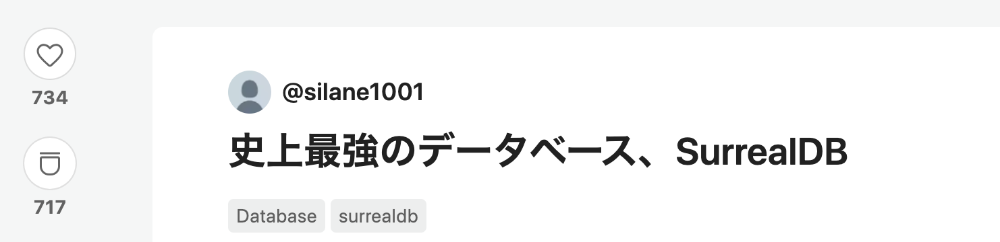
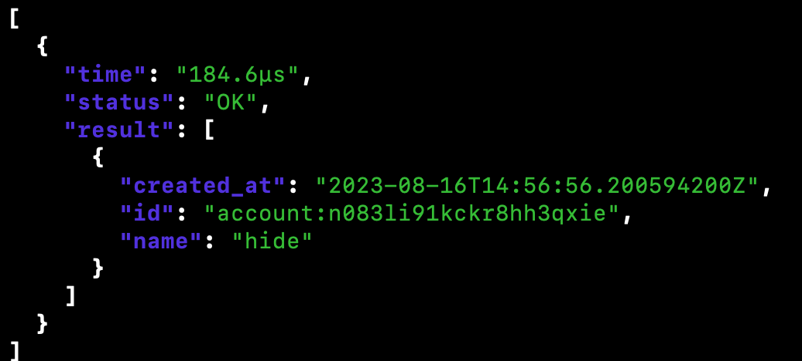
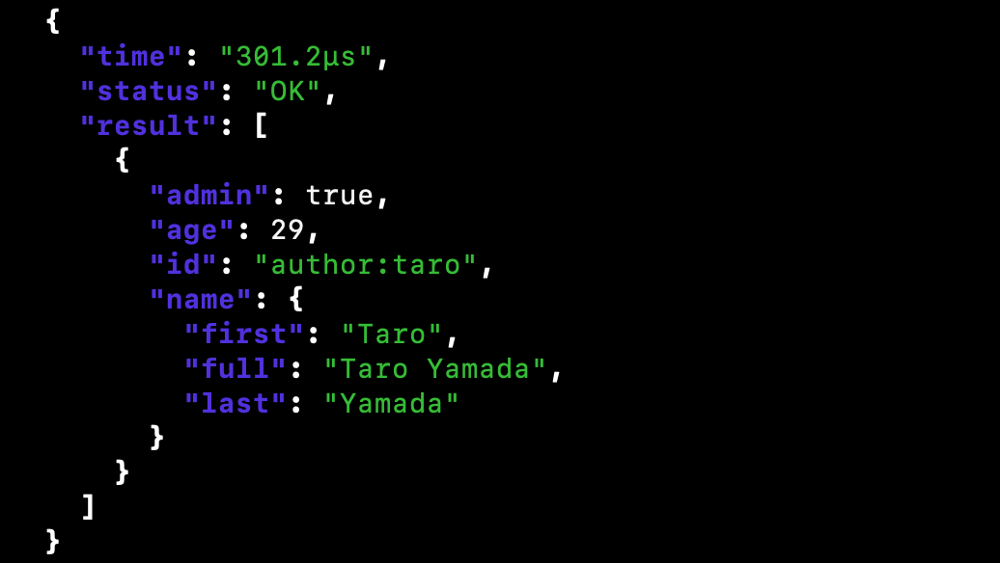
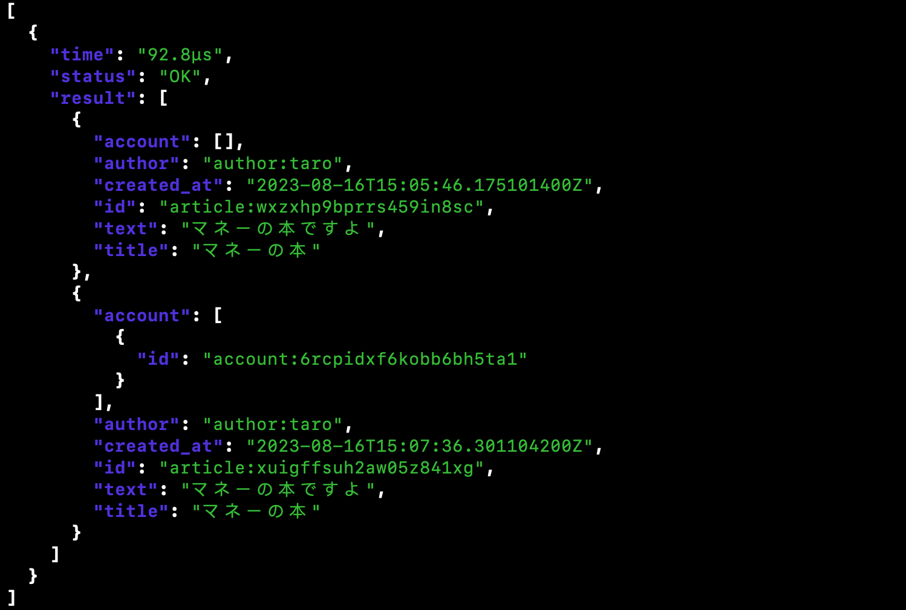
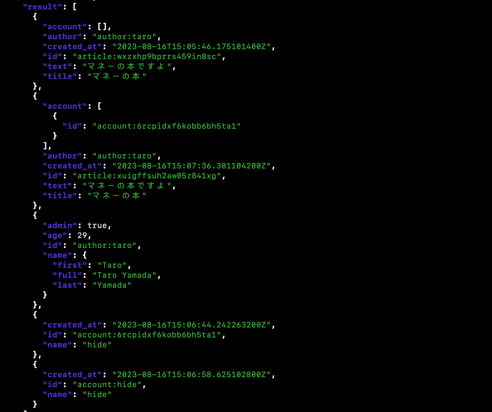
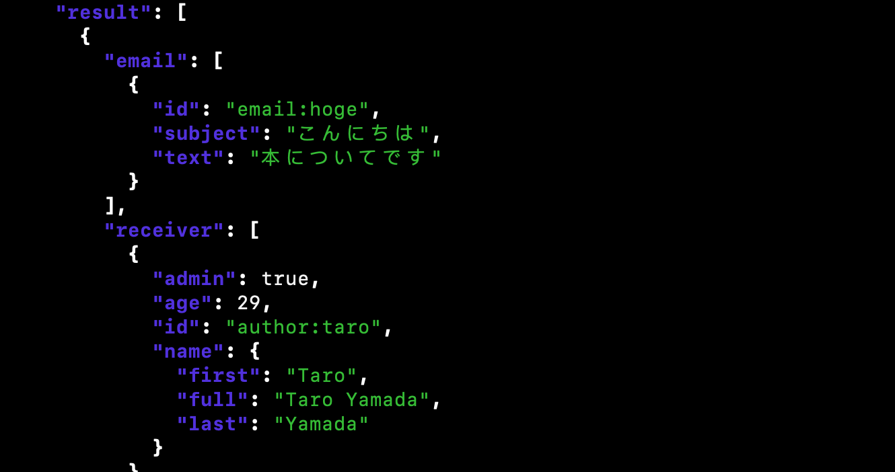

<!--
_class: lead
_footer: ""
_paginate: false
-->

# SurrealDB 触ってみた


---

# SurrealDB とは？

- 最近登場した Rust 製のデータベース
- Surreal(現実離れした)DB
- [史上最強のデータベース](https://qiita.com/silane1001/items/795c3539675e588c2c4d)らしい
- とにかくなんでもできる夢のデータベース



---

# 特徴

- リレーショナル、ドキュメント、グラフ、あらゆる種類のデータ構造を扱える
- インメモリ、単一ノード、分散環境など様々な環境で動かせる
- HTTP、WebSocket、(GraphQL)など様々なアクセス方法に対応
- ユーザ認証、認可機能とが DB 本体に内包
- ブラウザから直に接続する WebDB としても使える

---

# 特徴

- SurrealQL という高機能な SQL に似た言語を採用
- 複雑なリレーションを JOIN を使うのではなく、Record Links を使用
  - 複雑なリレーション関係を SQL より簡潔に記述できる
- JS の独自のロジックを埋め込んで柔軟にクエリすることもできる

---

# 実際に触ってみた

## インストール

Docker で実行する場合は以下。

```
$ docker run --rm --pull always -p 8000:8000 surrealdb/surrealdb:latest start --user root --pass root
```

参考: https://surrealdb.com/docs/installation/running/docker

---

## レコードの追加

account テーブルの一つのテーブルと一つのレコードを作成。

```sql
CREATE account
SET
  name = 'hide',
  created_at = time::now()
;
```

---

任意の id が登録される。



---

author テーブルとテーブルに含まれるレコードを作成する。

id を指定することも可能。（author:taro）

```sql
CREATE author:taro
SET
  name.first = 'Taro',
  name.last = 'Yamada',
  name.full = string::join(' ', name.first, name.last),
  age = 29,
  admin = true
;
```

---



---

先ほど作った著者とアカウントを記事に関連させる。
下記の例では著者のテーブル名を含んだレコード ID を直接指定（レコードリンク） している

```sql
CREATE article
SET
  author = author:taro,
  title = 'マネーの本',
  text = 'マネーの本ですよ',
  account = (SELECT id FROM account WHERE name = 'hide' LIMIT 1),
  created_at = time::now()
;
```

---

## レコードの取得

article を取得する。

```sql
SELECT * FROM article;
```

---



---

複数のテーブルから同時にレコードを取得することも可能。

```sql
SELECT * FROM article, author, account;
```

---



---

## グラフ

SurrealQL の特徴の一つにリレーションを辿るのが非常に簡単という点がある。

SurrealDB では、RELATE 文を使うことで、 JOIN を使用することなく関連するレコードを効率的に習得することができる。

参考: https://surrealdb.com/docs/surrealql/statements/relate

---

メールを表すレコードを追加し、そのメールが著者に送られたことを表現する Graph Edges を追加する。

```sql
CREATE email:hoge
SET
  subject = 'こんにちは',
  text = '本についてです'
;
RELATE email:hoge->to->author:taro
SET
  opened = false
```

---

さらに別の著者を追加し、このメールの送信者であることを表現する。

```sql
CREATE author:jiro
CONTENT {
  name: { first: 'Jiro', last: 'Maeda' }
};
RELATE author:jiro->send->email:hoge
CONTENT {
  time: '2022-10-18T07:31:49Z',
};
```

---

Jiro からのメールを開いていない受信者でかつ管理者を全て取得する。

```sql
SELECT ->send->(email as email)->(to WHERE opened = false)->(author WHERE admin = true as receiver)
FROM author:jiro FETCH email, receiver;
```

---



---

# 感想

- SurrealQL が扱いやすく複雑なリレーション関係の定義はしやすい
  - JOIN を使って複雑なクエリを書く必要がない
- Rust 製なのでパフォーマンス面は良さそう
- ただ、まだまだ開発途中
  - GCP へのデプロイはできない
  - GraphQL はまだ扱えない
- 何でもできるから逆に使いどころが分かりづらい
- 動向は追っておきたい
