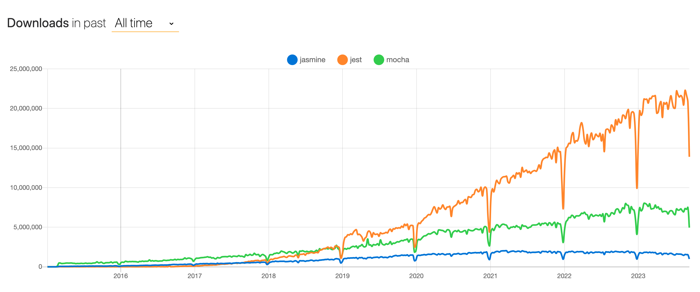

<!--
_class: lead
_footer: ""
_paginate: false
-->

# Jest 最初の一歩

---

# Jest とは何か？

- Jest = JavaScript(TypeScript)の testing library
- PHP で言うと PHPUnit のようなもの

---

- JavaScript のテスティングフレームワークの中だと一番人気

---

- PHPUnit との大きな違い
  - PHPUnit は xUnit 系のテスティングフレームーワークなのに対して、Jest は Spec 系のテスティングフレームワーク

---

<!--
_footer: ""
_paginate: false
-->

# xUnit? Spec?

- テスティングフレームワークは 2 系統に分かれる
  - ｘ Unit と Spec 系
- x Unit
  - JUnit(Java),PHPUnit(PHP)
- Spec 系
  - Jest(JavaScript),RSpec(Ruby)
  - テストケースの記述にフォーマットが決まっている。given/when/then
  - describe を使って階層構造を表現する

参考: [【ソフトウェアテスト】xUnit と Spec 系の比較](https://kzono.hatenablog.com/entry/2018/01/07/091428)

---

# Jest でテストを書く

- ファイル名は 〇〇.spec.js
- describe にテストの条件を記述
- test(it)に期待値を記述

---

# サンプルコード

---

# 実際のコード

---

# オススメの資料

---

# 終わりに

- 若干書き方は違うが、テストケースの考え方自体は PHPUnit と変わらない
  - 多分すぐ慣れる

これによりテスト自体の可読性が向上するのはもちろんのこと、以下のようにテストのログも見やすくなる。（テストがよりドキュメント・仕様書としての役割を果たしやすくなる）
