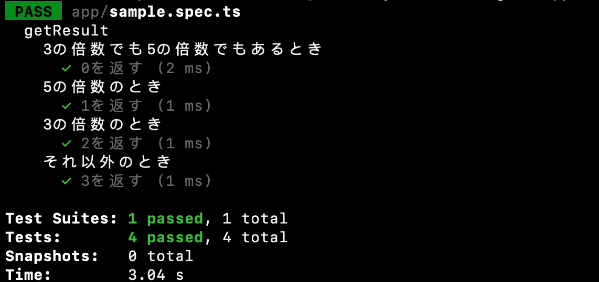
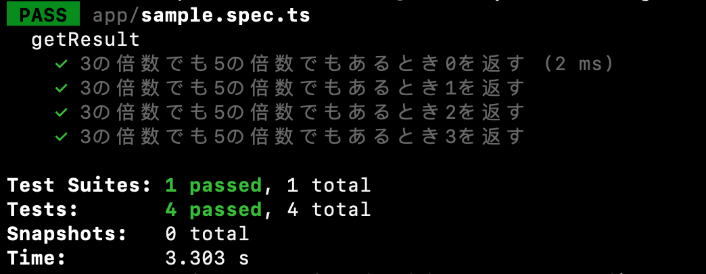
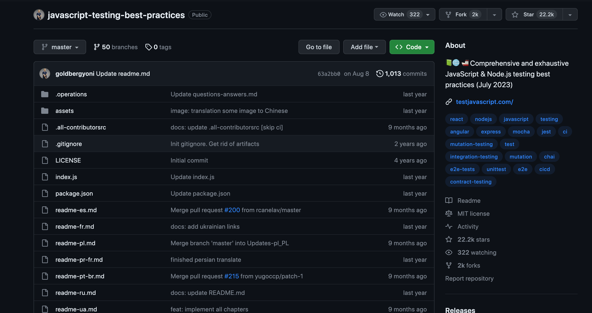

<!--
_class: lead
_footer: ""
_paginate: false
-->

# Jest 最初の一歩

---

# Jest とは何か？

- Jest = JavaScript(TypeScript)の testing library
- PHP で言うと PHPUnit のようなもの


---

- JavaScript のテスティングフレームワークの中だと一番人気
- リアーキでも使っている


---

- PHPUnit との大きな違い
  - PHPUnit は xUnit 系のテスティングフレームーワークなのに対して、Jest は Spec 系のテスティングフレームワーク

---

<!--
_footer: ""
_paginate: false
-->

# xUnit? Spec 系?

- テスティングフレームワークは 2 系統に分かれる
  - ｘ Unit と Spec 系
- x Unit
  - JUnit(Java),PHPUnit(PHP)
- Spec 系
  - Jest(JavaScript),RSpec(Ruby)
  - テストケースの記述にフォーマットが決まっている。given/when/then
  - describe を使って階層構造を表現できる

参考: [【ソフトウェアテスト】xUnit と Spec 系の比較](https://kzono.hatenablog.com/entry/2018/01/07/091428)

---

# Jest でテストを書く

- ファイル名は 〇〇.spec.js
- describe にテストの条件を記述
- test(it)に期待値を記述

---

# サンプルコード

```ts:sample.ts
export const getResult = (value: number): string => {
  if (value % 15 === 0) {
    return "0";
  } else if (value % 5 === 0) {
    return "1";
  } else if (value % 3 === 0) {
    return "2";
  } else {
    return "3";
  }
};
```

---

```ts:sample.spec.ts
import { getResult } from "./sample";

describe("getResult", () => {
  describe("3の倍数でも5の倍数でもあるとき", () => {
    test("0を返す", () => {
      const result = getResult(15);
      expect(result).toBe("0");
    });
  });

  describe("5の倍数のとき", () => {
    test("1を返す", () => {
      const result = getResult(25);
      expect(result).toBe("1");
    });
  });

  describe("3の倍数のとき", () => {
    test("2を返す", () => {
      const result = getResult(48);
      expect(result).toBe("2");
    });
  });

  describe("それ以外のとき", () => {
    test("3を返す", () => {
      const result = getResult(112);
      expect(result).toBe("3");
    });
  });
});
```

---

## 

---

```ts:sample.ts
import { getResult } from "./sample";

describe("getResult", () => {
  test("3の倍数でも5の倍数でもあるとき0を返す", () => {
    const result = getResult(15);
    expect(result).toBe("0");
  });

  test("3の倍数でも5の倍数でもあるとき1を返す", () => {
    const result = getResult(25);
    expect(result).toBe("1");
  });

  test("3の倍数でも5の倍数でもあるとき2を返す", () => {
    const result = getResult(48);
    expect(result).toBe("2");
  });

  test("3の倍数でも5の倍数でもあるとき3を返す", () => {
    const result = getResult(112);
    expect(result).toBe("3");
  });
});
```

---

## 

---

<!--
_footer: ""
_paginate: false
-->

ベストプラクティスを学ぶなら

## 

参考: [javascript-testing-best-practices](https://github.com/goldbergyoni/javascript-testing-best-practices)

---

# まとめ

- Jest は JavaScript(TypeScript)の testing library
- テスティングフレームワークにはｘ Unit と Spec 系がある
- Jest は Spec 系
- describe を使って階層構造を表現できる
- 若干書き方は違うが、テストケースの考え方自体は PHPUnit と変わらない
  - 多分すぐに慣れると思う
