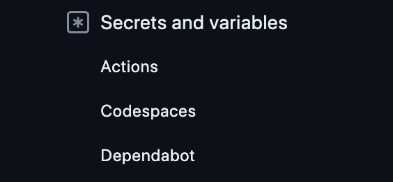

<!--
_class:
  - lead
  - invert
_footer: ""
-->

# GitHub Actions の

# 細かい仕様に苦しめられた話 🥲

---

## GitHub Actions とは何か？

自動テスト・自動リリース（CI/CD）を行うためのツール

<br>


---

<!--
_class:
  - lead
  - invert
_footer: ""
-->

### 【発生した事象】

## **Dependabot が作成する プルリクエスト で**

## **dev 環境にリリースできない...**

---

## Dependabot とは？

自動的にパッケージを更新してプルリクエストを発行してくれる GitHub の機能

<br>
<br>


---

## dev 環境とは？

各プルリクエストごとにリリースしている動作確認用の環境

---

<!--
_class:
  - lead
  - invert
_footer: ""
-->

## なぜ Dependabot の プルリクエスト で

## dev 環境にリリースできなかったのか？

---

## 原因: Dependabot から Secret の値を読めないから

- Secret = GitHub Actions で秘匿情報を保存する機能
- dev 環境をリリースするワークフロー上で Secret を参照
- **Dependabot は secret を読むことができない**のでエラーになった

```yml
steps:
  - id: generate-token
    uses: actions/create-github-app-token@f2acddfb5195534d487896a656232b016a682f3c # v1.9.0
    with:
      app-id: 386721
      private-key: ${{ secrets.KEY }} <--- ここでsecretを参照
      owner: ${{ github.repository_owner }}
```

---

<!--
_class:
  - lead
  - invert
_footer: ""
-->

# どう対応したか？

---

## トリガーを pull_request_target に変更した

- トリガー = ワークフローを動かす条件
- `pull_request`だと Dependabot から secret を読めない
- `pull_request_target`だと読める

<br>

```yml
name: release dev

on:
  # pull_request: <--- 変更前
  pull_request_target: <--- 変更後
```

---

<!--
_class:
  - lead
  - invert
_footer: ""
-->

# dev 環境にリリース
# できるようになった！

---

<!--
_class:
  - lead
  - invert
_footer: ""
-->

# 解決！


---

<!--
_class:
  - lead
  - invert
_footer: ""
-->

# してなかった...


---

<!--
_class:
  - lead
  - invert
_footer: ""
-->

### 【発生した事象 2】

## **変更を push しても dev 環境が更新されない...**

---

<!--
_class:
  - lead
  - invert
_footer: ""
-->

## なぜ dev 環境が更新されなくなったのか？

---

## 原因: トリガーを変更したことで github.sha の値が変化しなくなったから

- デプロイimageの値に`${{ env.IMAGE_URI }}:${{ github.sha }}-${{ github.run_attempt }}`のように github.sha の値を使用している
- **github.shaの値はトリガー毎に異なる**
  - pull_requestトリガー
    - 現在の作業ブランチの最後のコミット
  - pull_request_targetトリガー
    - ベースブランチの直近のコミット

---

- トリガーを pull_request_target に変えたことで、変更内容を push してもイメージが更新されなくなった

---

## 現状を整理

- pull_request トリガーだと Dependabot から secret を読めない
- pull_request_target トリガーだと dev 環境が更新されない

---

<!--
_class:
  - lead
  - invert
_footer: ""
-->

# どうする？


---

## 解決策: Dependabot Secret を利用する

- Dependabot Secret = Dependabot 用の secret
- Dependabot Secret を使うと、pull_request トリガーを利用しても**Dependabot から secret の値を参照できる**

<br>



---

## 最終的にはこうなった

※関係ない部分は省略しています

```yml
on:
  pull_request: <--- 変更をpushするたびにgithub.shaの値を更新させる
jobs:
  push-image:
    steps:
      - name: Build docker image
          tags: ${{ env.IMAGE_URI }}:${{ github.sha }}-${{ github.run_attempt }}

  dispatch-release-envoy-gateway:
    steps:
      - id: generate-token
        with:
          private-key: |
            ${{ secrets.KEY }} <--- Dependabotの場合はDependabot Secret から値を参照する
```

---

<!--
_class:
  - lead
  - invert
_footer: ""
-->

## 全てのプルリクエストで dev 環境が

## リリース&更新されるようになった！

---

<!--
_class:
  - lead
  - invert
_footer: ""
-->

# 今度こそ解決！


---

## まとめ

- github.sha はトリガー毎に取得されるハッシュ値が異なる
- Dependabot から Secret の値を参照したいときは Dependabot Secretを使う

---

<!--
backgroundColor: black
footer: ""
-->
