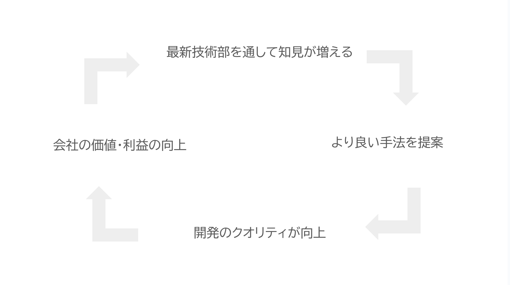

<!--
_class:
  - lead
  - invert
_footer: ""
-->

# 最新技術部のすゝめ:robot:

---

## 最新技術部とは

- 最新技術を学ぶ勉強会
- 毎週火曜の 18:30〜19:30 に Google Meet で開催
- 発足から一年:tada:

---

## 最新技術部の目的

最新技術をキャッチアップして自身と会社の成長に繋げる

---

## 理想の状態

---

## 活動内容

- 技術トピック共有
  - 技術記事など技術に関する情報ならなんでも
  - 共有内容は最新技術でなくても良い
    - 自分が初めて知ったこと、他の人にも共有したいことであれば何でも OK

---

## 最新技術部に参加するメリット

- 最新技術に詳しくなる
- エンジニアとして働く中での選択肢が増える
- チーム外のエンジニアとコミュニケーションを取る機会を得られる
- 楽しい

---

## 今後の展望

- インプット効率の向上
- 最新技術部で得られた知見をエンジニア全体に共有する
- 最新技術部で得た知見を業務で引き出せる仕組み

---

## おわりに

毎週火曜 18:30~開催しているので、余裕があるときに参加してもらえると嬉しいです

---

<!--
backgroundColor: black
footer: ""
-->
