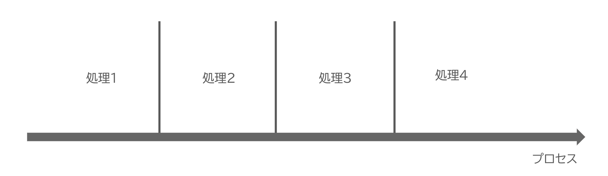
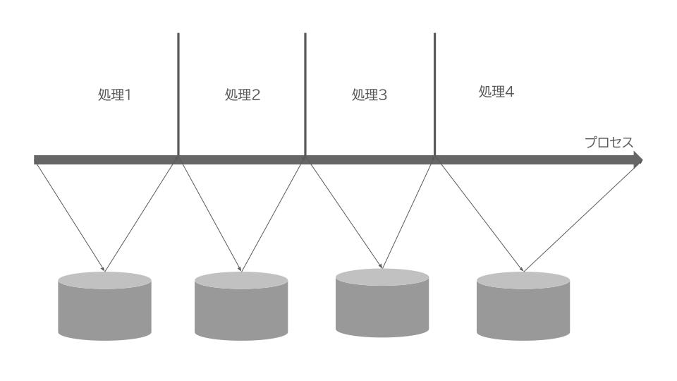
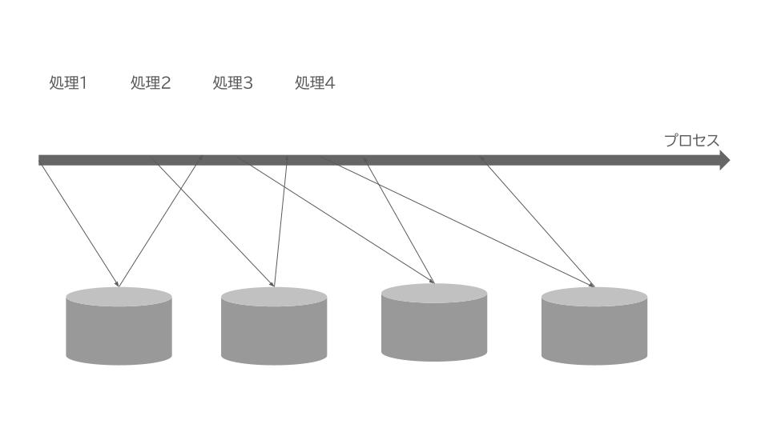

<!--
_class:
  - lead
  - invert
_footer: ""
-->

# JavaScriptの非同期処理を理解する

---

## 非同期処理とは何か？

- 裏で行われる処理
- 時間がかかる処理
    - e.g. 通信、ファイルの読み書き、DBへのアクセス

---

## JavaScriptにおける非同期処理

- JS・TSでは時間がかかる処理は非同期（ノンブロッキング）で実行するのが推奨されている
- なぜなら、JSでは、実行モデルとしてシングルスレッド（single-threaded）が採用されているから
- シングルスレッドかつ通信処理が同期的（ブロッキング）だと、あるクライアントと通信している際にプログラムの実行がストップしてしまって非効率

---

## シングルスレッドとは

- 一つの実行環境（ node index.jsなどの形で起動されるプロセス）内でプログラムの複数箇所が同時に（並列に）実行されることはない
- TypeScriptプログラムが実行される場合、常にプログラムのある1箇所のみが実行される



---

## シングルスレッドかつブロッキング



---

## シングルスレッドかつノンブロッキング



---

## 非同期処理をJS・TSから扱う方法

- コールバック関数
- Promise

---

## コールバック関数

- 最も原始的な方法
- ES2015でPromiseが導入されるまでは、非同期処理はコールバック関数で表すのが普通だった
- 非同期処理が終わった後に呼び出される関数

```ts
console.log('1. 処理開始');
readFile('hoge.txt', (data) => {
  console.log('3. 読み込み完了');
});
console.log('3. 読み込み開始');
```

---

## Promise

- ES2015で追加された非同期処理のための機能
- 非同期処理そのものを表すオブジェクト
- Promiseを使うことで、より便利かつ分かりやすい形で非同意処理を扱うことができる
- 非同期処理においては「終わったあとに何をするか」を表す関数が不可欠
- コールバック関数ベースの非同期処理の場合は非同期処理を開始する関数（e.g. setTimeout, readFile）に直接これをコールバック関数として渡していた
- 非同期処理を行う関数はPromiseオブジェクトを返す
- Promiseオブジェクトに対して、thenメソッドで終わった後に行う処理を表す関数を登録する
- 関数は、当該Promiseが表す非同期処理が完了した時点で呼び出される

```ts
import { readFile } from "fs/promises";

// pの型はPromise<string>。非同期関数がPromiseを返す
const p = readFile("foo.txt", "utf8");

p.then((data) => {
  // 非同期処理が完了したときに呼び出される
  console.log(data);
})
```

--- 

## コールバック関数からの変化

- 従来は「非同期処理を行う関数にコールバック関数を直接渡す」という人まとまりの処理だった
- 「非同期処理を行う関数はPromiseオブジェクトを返す」「返されたPromiseオブジェクトにthenでコールバック関数を渡す」という2段階の処理に分離された
- より抽象的・統一的い非同期処理を表すことができる

---

## Promiseの動作の流れを図解

```ts
import { readFile } from "fs/promises";

// 1. 非同期関数からPromiseを受け取る
// pの型はPromise<string>。非同期関数がPromiseを返す
const p = readFile("foo.txt", "utf8");

// 2. 非同期処理が完了したら非同期関数がPromiseに対して結果を登録する
p.then((data) => {
  // 非同期処理が完了したときに呼び出される
  console.log(data);
})
```


---

## Promiseのメリット

- コールバック関数を直接渡す方式の場合、使いたいAPIごとにコールバック関数をどのように渡せばいいかを調べる必要がある
- PromiseベースのAPIでは非同期処理を行う関数ならどんな関数でも「PromiseおBっジェクトを返す」という点で共通しており、結果も「Promiseの解決」という共通の機構をと通して伝えられる
- これにより、利用する側はPromiseの使い方さえ覚えていれば非同期処理の結果を無事に受け取ることができる
- Promiseオブジェクトのthenに渡すコールバック関数は常に1引数であり、どんな非同期処理であろうと共通

---

<!--
backgroundColor: black
footer: ""
-->
