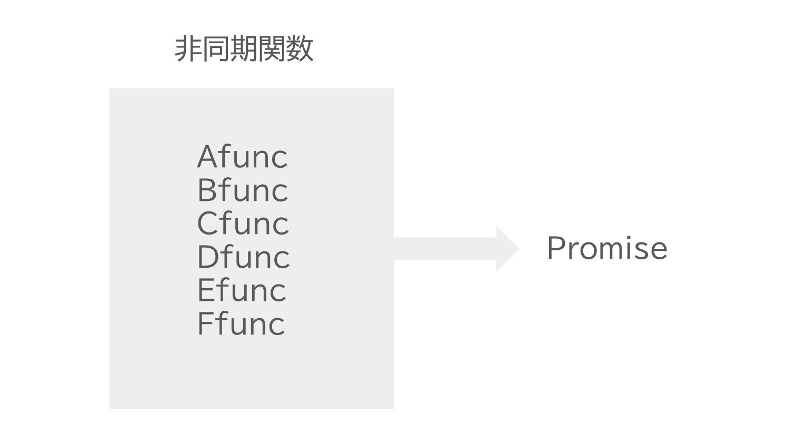

<!--
_class:
  - lead
  - invert
_footer: ""
-->

# JavaScriptの非同期処理を理解する

---

## 非同期処理とは何か？

- バックグラウンドで行われる処理
  - e.g. 通信、ファイルの読み書き、DBへのアクセスなどの時間がかかる処理

---

## JSでは時間がかかる処理は非同期（ノンブロッキング）で実行するのが推奨

- JSは実行モデルとしてシングルスレッドを採用
- シングルスレッドかつ処理が同期的（ブロッキング）だと非効率

---

## シングルスレッドとは

プログラムが直列に処理される


---

## シングルスレッドかつブロッキング（同期）


---

## シングルスレッドかつノンブロッキング（非同期）


---

## 非同期処理をJSから扱う方法

- コールバック関数
- Promise

---

## コールバック関数

- 最も原始的な方法
- Promiseが導入されるまでは、非同期処理はコールバック関数で表すのが普通だった

```ts
readFile('hoge.txt', (data) => {
  // 非同期処理が完了したときに呼び出される
  console.log(`読み込み完了！: ${data}`);
});
```

---

## コールバック関数の課題

- コールバック地獄
  - 非同期処理を順に実行しようとするとネストが深くなって可読性が悪化する
- コールバック関数を直接渡す方式の場合、使いたい非同期関数ごとにコールバック関数をどのように渡せばいいかを調べる必要がある

--- 

## コールバック地獄

```ts
// 3 -> 2 -> 1 と表示される
setTimeout(() => {
  console.log(3);
  setTimeout(() => {
    console.log(2);
    setTimeout(() => {
      console.log(1);
      setTimeout(() => {
        console.log('GO!');
      }, 1000);
    });
  }, 1000);
}, 1000);
```

---

## 非同期関数ごとにコールバック関数をどのように渡せばいいかを調べる必要がある


---

## Promise

- 非同期処理の状態や結果を表現するビルトインオブジェクト
- 非同期処理を行う関数はPromiseオブジェクトを返す
- Promiseオブジェクトに対して、thenメソッドで終わった後に行う処理を表す関数を登録する

---

```ts
// 1. 非同期関数からPromiseを受け取る
// pの型はPromise<string>
const p = readFile("foo.txt", "utf8");

// 2. thenで非同期処理が完了したあとに呼び出す処理を登録する
// 実際に非同期処理が完了したら、非同期関数（readFile）がPromiseに対して結果を登録する（Promiseの解決）
p.then((data) => {
  // 3. 非同期処理が完了したあとに呼び出される
  console.log(`非同期処理が完了しました！: ${data}`);
})
```

--- 

## コールバック関数からの変化

- コールバック地獄の改善
- 従来は「非同期処理を行う関数にコールバック関数を直接渡す」というひとまとまりの処理だった
  - 2つに分離された
    1. 非同期処理を行う関数はPromiseオブジェクトを返す
    2. 返されたPromiseオブジェクトにthenでコールバック関数を渡す
  - より抽象的・統一的に非同期処理を表すことができるように

---

## コールバック地獄の改善

```ts
new Promise<void>((resolve) => {
  setTimeout(() => {
    console.log(3);
    resolve();
  }, 1000);
})
  .then(
    () =>
      new Promise<void>((resolve) => {
        setTimeout(() => {
          console.log(2);
          resolve();
        }, 1000);
      }),
  )
  .then(
    () =>
      new Promise<void>((resolve) => {
        setTimeout(() => {
          console.log(1);
          resolve();
        }, 1000);
      }),
  );
```

---

<!--
_class:
  - lead
  - invert
_footer: ""
-->

## より抽象的・統一的に非同期処理を表すことができるように

---

コールバック関数を直接渡す方式の場合、使いたい関数ごとにコールバック関数をどのように渡せばいいかを調べる必要がある


---

PromiseベースのAPIでは非同期処理を行う関数ならどんな関数でも`Promiseを返す`という点で共通している



---

Promiseの使い方さえ覚えていれば非同期処理の結果を受け取ることができる


---

## Promiseの課題

- 可読性が悪い
- もっとシンプルに書けないか？

---

## async/await構文

- Promiseをベースとした非同期関数を扱うための便利な機能
- thenよりもasync/awaitの方がよく使う

---

## async関数

- async関数の返り値は必ずPromiseになる
- async関数内部でreturn文が実行された場合、return文で返された値が返り値のPromiseの結果となる

```ts
// Promiseオブジェクトを返す
async function get(): Promise<number> {
  return 10;
}
```

---

## await式

- `await 式`という形式を取る
- 与えられたPromiseの結果が出るまで待つ
  - thenの代わりに使用できる

```ts
async function get() {
  // Promiseの解決を待つ
  await sleep(1000);
  await sleep(2000);
  return 10;
}
```

--- 

## async/awaitのメリット

- readFile(...).then(...)のようにthenを使うよりも記述がシンプルになる
- 「ある非同期処理が終わってから次の非同期処理をする」というプログラムをまるで同期プログラムのように書くことができる
  - 非同期処理を同期的に書ける

---

## よりシンプルな記述に

```ts
function delay() {
  return new Promise((resolve) => setTimeout(resolve, 1000));
}
async function countdown() {
  await delay();
  console.log(3);
  await delay();
  console.log(2);
  await delay();
  console.log(1);
}
countdown();
```

---

## まとめ

- JSはシングルスレッドなので、時間がかかる処理はノンブロッキング（非同期）で処理することが推奨されている
- JSで非同期関数を表現する方法
  - コールバック関数
  - Promise
- asycn/awaitを使うことで、よりPromiseを簡単に扱うことができる

---

## 今後やりたいこと

- 非同期処理のより深い仕組みを調べてみる
  - タスクキュー、コールスタック、イベントループ...

---

<!--
backgroundColor: black
footer: ""
-->
