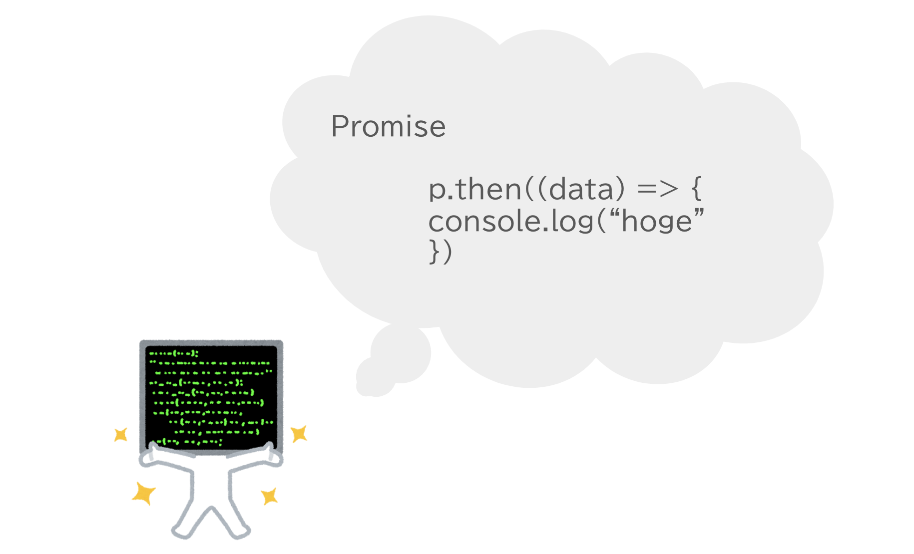

<!--
_class:
  - lead
  - invert
_footer: ""
-->

# JavaScriptの非同期処理を理解する

---

## 非同期処理とは何か？

- 裏（バックグラウンド）で行われる処理
  - e.g. 通信、ファイルの読み書き、DBへのアクセスなどの時間がかかる処理
- 並行して処理を次々に実行するための仕組み

---

## JSでは時間がかかる処理は非同期（ノンブロッキング）で実行するのが推奨

- JSは実行モデルとしてシングルスレッドを採用
- シングルスレッドかつ処理が同期的（ブロッキング）だと非効率

---

## シングルスレッドとは

一つの実行環境内でプログラムの複数箇所が並列に実行されることはない


---

## シングルスレッドかつブロッキング（同期）


---

## シングルスレッドかつノンブロッキング（非同期）


---

## 非同期処理をJS・TSから扱う方法

- コールバック関数
- Promise

---

## コールバック関数

- 最も原始的な方法
- ES2015でPromiseが導入されるまでは、非同期処理はコールバック関数で表すのが普通だった

```ts
readFile('hoge.txt', (data) => {
  // 非同期処理が完了したときに呼び出される
  console.log(`読み込み完了！: ${data}`);
});
```

---

## コールバック関数の課題

- コールバック地獄
  - 非同期処理を順に実行しようとするとネストが深くなって可読性が悪化する
- コールバック関数を直接渡す方式の場合、使いたいAPIごとにコールバック関数をどのように渡せばいいかを調べる必要がある

--- 

## コールバック地獄

ネストが深くて可読性が悪い。

```ts
// 3 -> 2 -> 1 と表示される
setTimeout(() => {
  console.log(3);
  setTimeout(() => {
    console.log(2);
    setTimeout(() => {
      console.log(1);
      setTimeout(() => {
        console.log('GO!');
      }, 1000);
    });
  }, 1000);
}, 1000);
```

---

## コールバック関数を直接渡す方式の場合、使いたいAPIごとにコールバック関数をどのように渡せばいいかを調べる必要がある

---

## Promise

- ES2015で追加された非同期処理のための機能
- 非同期処理の状態や結果を表現するビルトインオブジェクト
- 「後で値を返すから待っててね」という約束
- 連続した非同期処理をフラットに書ける
- 状態を持つ
- 非同期処理を行う関数はPromiseオブジェクトを返す
- Promiseオブジェクトに対して、thenメソッドで終わった後に行う処理を表す関数を登録する

---

```ts
// 1. 非同期関数からPromiseを受け取る
// pの型はPromise<string>
const p = readFile("foo.txt", "utf8");

// 2. thenで非同期処理が完了したあとに呼び出す処理を登録する
// 実際に非同期処理が完了したら、非同期関数（readFile）がPromiseに対して結果を登録する（Promiseの解決）
p.then((data) => {
  // 3. 非同期処理が完了したあとに呼び出される
  console.log(`非同期処理が完了しました！: ${data}`);
})
```

--- 

## コールバック関数からの変化

- コールバック地獄の改善
- 従来は「非同期処理を行う関数にコールバック関数を直接渡す」というひとまとまりの処理だった
- 2つに分離された
  1. 非同期処理を行う関数はPromiseオブジェクトを返す
  2. 返されたPromiseオブジェクトにthenでコールバック関数を渡す
- より抽象的・統一的に非同期処理を表すことができるように

---

## コールバック地獄の改善

ネストが消えてフラットに。
だが、thenで繋げていくのはまだ見づらい。そこでこの後async/awaitが生まれる。

```ts
new Promise<void>((resolve) => {
  setTimeout(() => {
    console.log(3);
    resolve();
  }, 1000);
})
  .then(
    () =>
      new Promise<void>((resolve) => {
        setTimeout(() => {
          console.log(2);
          resolve();
        }, 1000);
      }),
  )
  .then(
    () =>
      new Promise<void>((resolve) => {
        setTimeout(() => {
          console.log(1);
          resolve();
        }, 1000);
      }),
  );
```

---

<!--
_class:
  - lead
  - invert
_footer: ""
-->

## より抽象的・統一的に非同期処理を表すことができるように

---

コールバック関数を直接渡す方式の場合、使いたいAPIごとにコールバック関数をどのように渡せばいいかを調べる必要がある


---

PromiseベースのAPIでは非同期処理を行う関数ならどんな関数でも`Promiseを返す`という点で共通している


---

Promiseの使い方さえ覚えていれば非同期処理の結果を受け取ることができる



---

## Promiseのメソッド1: Promise.all

- 複数のPromiseを合成するメソッド
- Promiseオブジェクトの配列を引数として受け取り、「それら全てが成功したら成功となるPromiseオブジェクト」を作って返す
- 複数の非同期処理を並行して行いたい場合に適している

```ts
Promise.all([
  prisma.users.deleteMany(),
  prisma.posts.deleteMany(),
  prisma.comments.deleteMany(),
])
```

---

## Promiseのメソッド2: Promise.race

- Promiseの配列を受け取る
- 最も早く成功または失敗したものの結果を、全体の（Promise.raceが返したPromiseの）結果とする

```ts
Promise.race([promise1, promise2]).then((value) => {
  // promise1, promise2のうち、先に成功した結果を返す
  console.log(value);
});
```

---

## Promiseの課題

- まだネストが深い
- もっとシンプルに書けないか？

---

## async/await構文

- Promiseをベースとした非同期関数を扱うための便利な機能
- Async/await（エイシンク/アウェイト）は、Promiseのシンタックスシュガー（syntax sugar・糖衣構文）
- thenよりもasync/awaitの方がよく使う

---

## async関数

- async関数の返り値は必ずPromiseになる
- async関数内部でreturn文が実行された場合、return文で返された値が返り値のPromiseの結果となる

```ts
// Promiseオブジェクトを返す
async function get3(): Promise<number> {
  return 3;
}
```

---

## await式

- await式はasync関数の中で使える構文
- `await 式(Promiseオブジェクト)`という形式を取る
- 与えられたPromiseの結果が出るまで待つ
  - thenの代わりに使用することが多い

```ts
async function get3() {
  // Promiseの解決を待つ
  await sleep(1000);
  await sleep(2000);
  return 3;
}
```

--- 

## async/awaitのメリット

- readFile(...).then(...)のようにthenを使うよりも記述がシンプルになる
- 「ある非同期処理が終わってから次の非同期処理をする」というプログラムをまるで同期プログラムのように書くことができる
  - 非同期処理を同期的に書ける

---

## thenよりシンプルな記述に

```ts
function delay() {
  return new Promise((resolve) => setTimeout(resolve, 1000));
}
async function countdown() {
  await delay();
  console.log(3);
  await delay();
  console.log(2);
  await delay();
  console.log(1);
}
countdown();
```

---

## まとめ

- JSで非同期関数を表現する方法
  - コールバック関数
  - Promise
- asycn/awaitを使うことで、よりPromiseを簡単に扱うことができる

---

<!--
backgroundColor: black
footer: ""
-->
