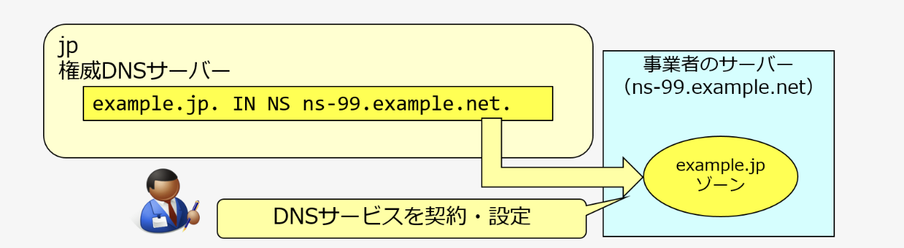
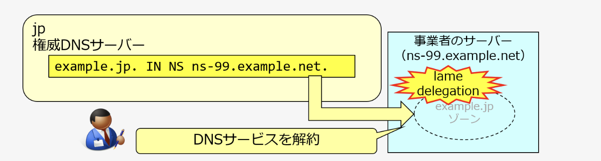
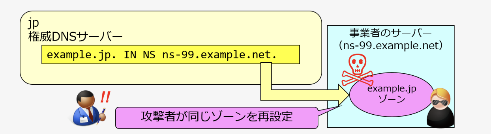

<!--
_class: lead
_footer: ""
_paginate: false
-->

# 最近勉強したこと

---

# 先週 JPRS がある記事を発表した

[サービス終了後に残っているDNS設定を利用したサブドメインの乗っ取りについて](https://jprs.jp/tech/security/2025-01-21-danglingrecords.html)

---

# 記事の内容(要約)

- ダングリングレコードがあると、サブドメインテイクオーバーやNSテイクオーバーの被害に遭う可能性がある
- これらの被害に遭わないためにも、不要になったレコードは忘れずに削除するのが重要

---

# いくつか知らない単語があったので調べてみた

- **ダングリングレコード**があると、**サブドメインテイクオーバー**や**NSテイクオーバー**の被害に遭う可能性がある
- これらの被害に遭わないためにも、不要になったレコードは忘れずに削除するのが重要

---

# dangling records（ダングリングレコード）

- 指定された名前の実体が無効になっているDNSレコード
- e.g. CNAMEリソースレコードの指定先にWebサーバーが存在しない

---

<!--
_class:
  - lead
  - invert
_footer: ""
-->

# サブドメインテイクオーバー

---

---

---

---

<!--
_class:
  - lead
  - invert
_footer: ""
-->

# NSテイクオーバー

---

---

--- 

---

# まとめ

- dangling records（ダングリングレコード）
    - 指定された名前の実体が無効になっているリソースレコード
- サブドメインテイクオーバー
    - ドメインの管理権限を持たない第三者が、そのサブドメインの乗っ取りを図る攻撃手法
- NSテイクオーバー
    - ドメインの管理権限を持たない第三者が、そのゾーン（ドメイン名）の乗っ取りを図る攻撃手法
- 不要になったレコードは忘れずに消すのが大事

---

# 参考資料

- [dangling records（ダングリングレコード）](https://jprs.jp/glossary/index.php?ID=0274)
- [Subdomain Takeover（サブドメインテイクオーバー）](https://jprs.jp/glossary/index.php?ID=0267)
- [NS Takeover（エヌエステイクオーバー）](https://jprs.jp/glossary/index.php?ID=0272)
- [終わったWebサイトのDNS設定、そのままになっていませんか？](https://jprs.jp/tech/security/2025-01-21-danglingrecords.pdf)

---

<!--
backgroundColor: black
footer: ""
-->
