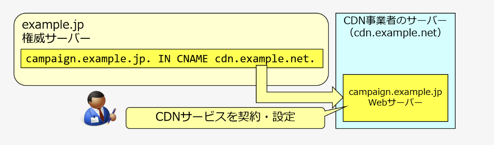

<!--
_class:
  - lead
_footer: ""
_paginate: false
-->

# 最近勉強したこと

## 2025/1/29

---

# 先週 JPRS がある記事を発表した

https://jprs.jp/tech/security/2025-01-21-danglingrecords.html

---

# 記事の内容(要約)

- ダングリングレコードがあると、サブドメインテイクオーバーの被害に遭う可能性がある
- これらの被害に遭わないためにも、不要になったレコードは忘れずに削除することが重要

---

# いくつか知らない単語があったので調べてみた

- **ダングリングレコード**があると、**サブドメインテイクオーバー**の被害に遭う可能性がある
- これらの被害に遭わないためにも、不要になったレコードは忘れずに削除することが重要

---

# dangling records（ダングリングレコード）

- 指定された名前の実体が無効になっている DNS レコード
- e.g. CNAME レコードの指定先に CDN が存在しない, A レコードの指定先に Web サーバーが存在しない

---

# サブドメインテイクオーバー

- ドメインの管理権限を持たない第三者が、そのサブドメインの乗っ取りを図る攻撃手法

---

 

campaign.example.jp にリクエストが来たら cdn.example.net の CDN にリクエストを流すサービス

---

 

CDN サービスを解約

---

 

第三者が CDN を契約して cdn.example.net のサーバー設定を追加

campaign.example.jp が悪意のあるサイトに成り代わってしまう

---

 

乗っ取られないためには不要になった DNS レコードは削除しておくことが重要

---

# まとめ

- **dangling records（ダングリングレコード）**
  - 指定された名前の実体が無効になっているリソースレコード
- **サブドメインテイクオーバー**
  - ドメインの管理権限を持たない第三者が、そのサブドメインの乗っ取りを図る攻撃手法
- **不要になったレコードは忘れずに消す**のが大切

<!-- ---

# 参考資料

- [dangling records（ダングリングレコード）](https://jprs.jp/glossary/index.php?ID=0274)
- [Subdomain Takeover（サブドメインテイクオーバー）](https://jprs.jp/glossary/index.php?ID=0267)
- [NS Takeover（エヌエステイクオーバー）](https://jprs.jp/glossary/index.php?ID=0272)
- [終わった Web サイトの DNS 設定、そのままになっていませんか？](https://jprs.jp/tech/security/2025-01-21-danglingrecords.pdf) -->

---

<!--
backgroundColor: black
footer: ""
-->
