<!--
_class: lead
_footer: ""
_paginate: false
-->

# Gemini Deep Research が便利すぎる

## 2025/1/31

---

# Gemini とは？🤖

Google の生成 AI

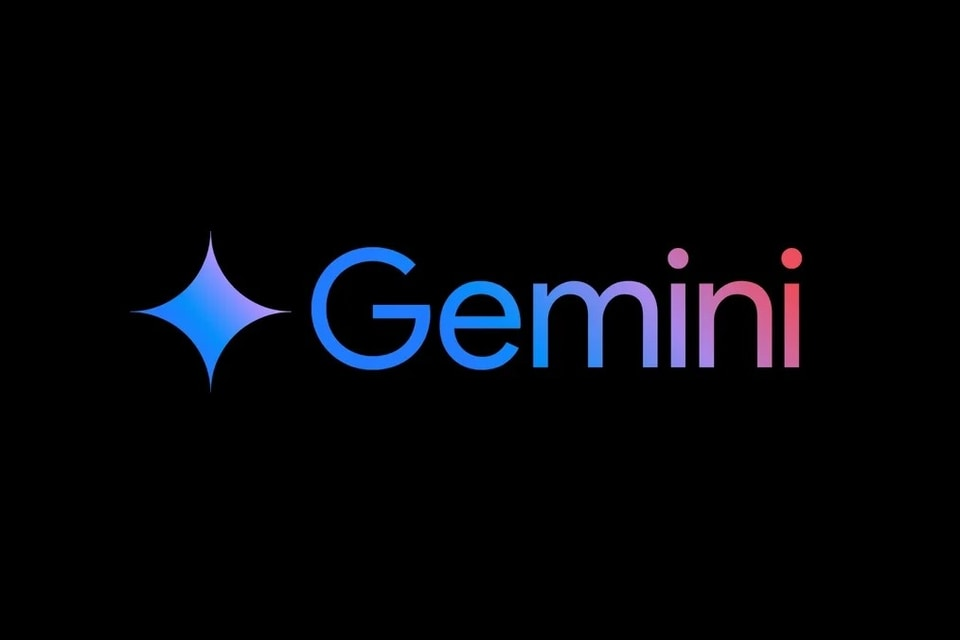

---

# Gemini Deep Research とは？

- 2024 年 12 月 11 日に発表
- Gemini の最新 AI モデル Gemini 1.5 Pro を搭載した、次世代型のリサーチツール
- 自律的に調査計画を立案、実行
- Web 上の膨大な情報源から、必要な情報を迅速かつ正確に収集・分析し、レポート形式で提供

---

# 2025 年 1 月 15 日: 日本語にも対応

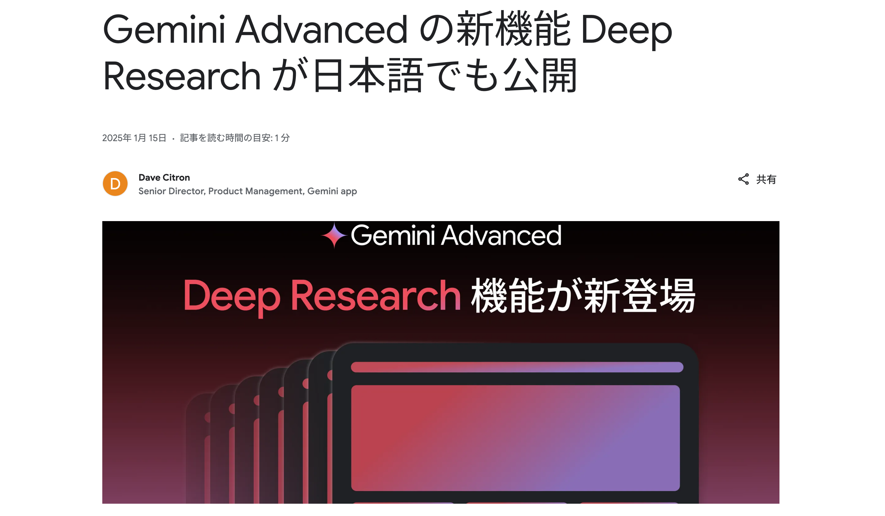

https://blog.google/intl/ja-jp/company-news/technology/gemini-advanced-deep-research/

---

# Gemini Deep Research の特徴

- 圧倒的な効率性
- Google の多様な情報源へのアクセス

---

## 圧倒的な効率性

- リサーチ業務の完全自動化
  - 関連キーワードで検索
  - 複数のウェブサイトを閲覧
  - 情報を取捨選択し、整理
  - 分析し、レポートにまとめる

---

## Google の多様な情報源へのアクセス

- Web サイト
  - ニュースサイト、企業サイト、ブログ、フォーラムなど、あらゆる Web サイト
- 書籍
  - Google Books などのデジタル化された書籍データ
- 論文
  - 学術論文データベース (Google Scholar、arXiv など)
- ソーシャルメディア
  - YouTube、note など各種ソーシャルメディア

---

# プランについて

- Google One AI プレミアムプランへの登録が必要
- 月額 2,900 円
- **初月は無料**

---

<!--
_class:
  - lead
-->

# Gemini Deep Research を使ってみた

---

## Gemini Advanced にアップグレード

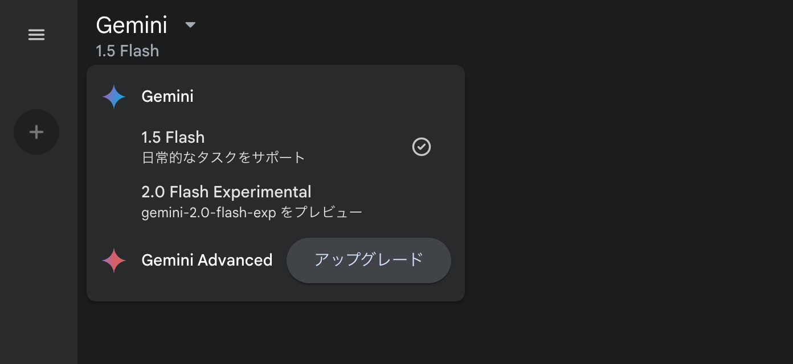

---

## Deep Research を選択

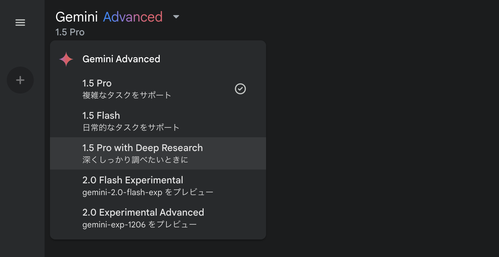

---

## 質問してみる

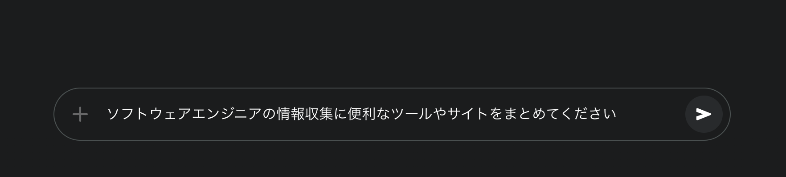

---

## 調査の計画を出してくれる

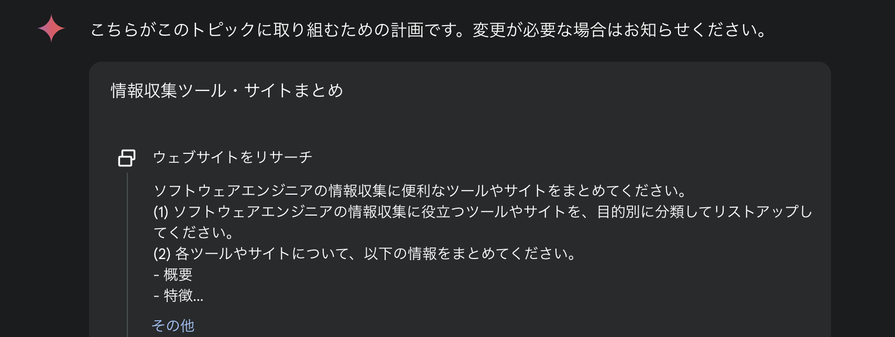

---

## リサーチを開始

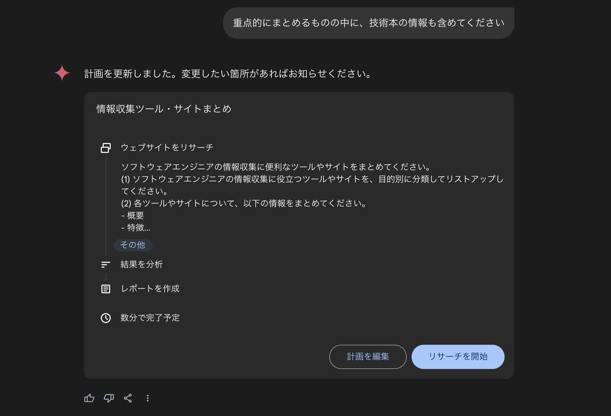

---

## 勝手に調査してくれる

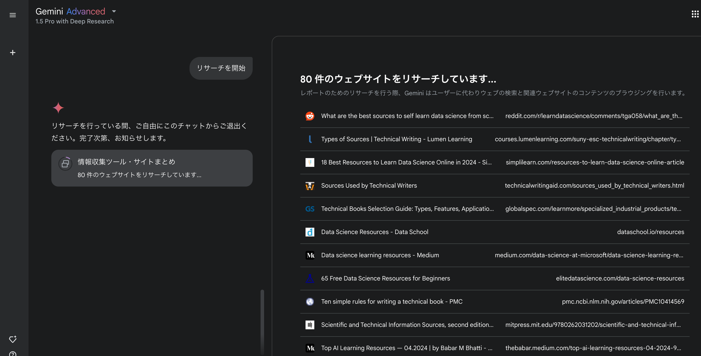

---

## 数分でリサーチ完了

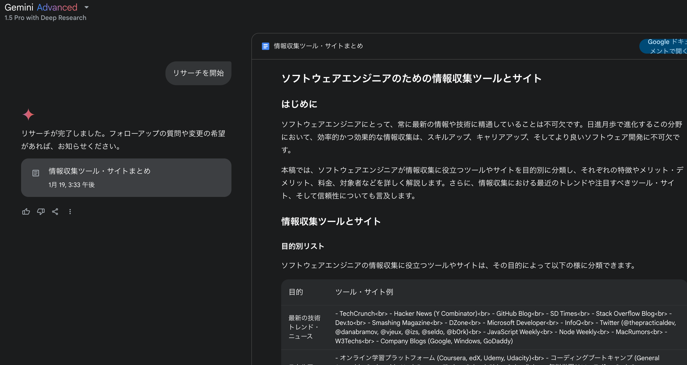

---

## 多数のサイトを参照してくれる

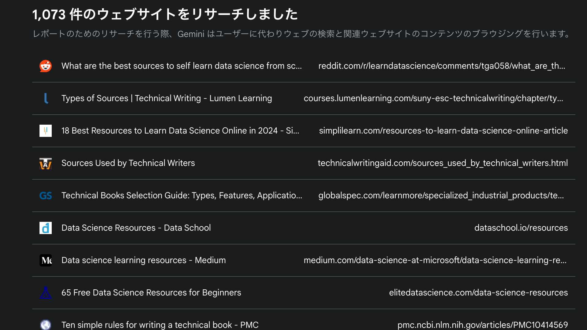

---

## Google ドキュメントで開くことも可能

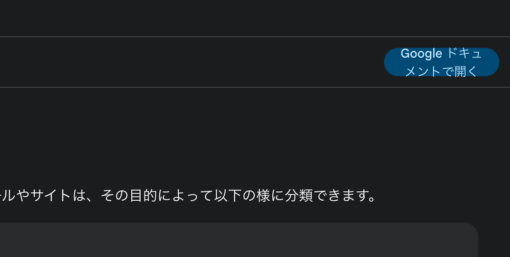

---

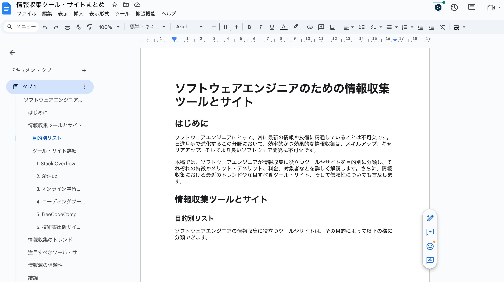

---

# 感想

- リサーチ業務や特定のトピックに関する学習はかなり捗りそう
- 引用文献も出してくれるので、情報の信頼性も判断しやすい
- 初月は無料なので、とりあえず試してみるのもおすすめ

---

<!--
backgroundColor: black
footer: ""
-->
