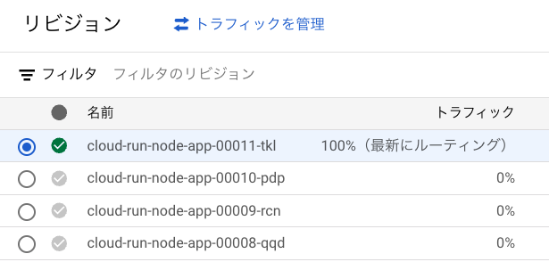
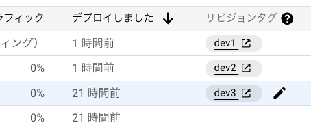
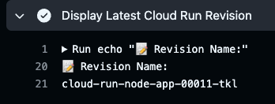

<!--
_class:
    - lead
    - invert
_footer: ""
_paginate: false
-->

# 勉強したこと

<!-- # Cloud Run を爆速で切り戻す -->

---

<!--
_class:
    - lead
    - invert
_footer: ""
_paginate: false
-->

# 突然ですが

---

<!--
_class:
    - lead
    - invert
_footer: ""
_paginate: false
-->

# こんな経験はありませんか？

---

<!--
_class:
    - lead
    - invert
_footer: ""
_paginate: false
-->

# 新機能をリリース！🚀


---

<!--
_class:
    - lead
    - invert
_footer: ""
_paginate: false
-->

# 祝杯🍻


---

<!--
_class:
    - lead
    - invert
_footer: ""
_paginate: false
-->

# 大量のエラーが発生💥


---

<!--
_class:
    - lead
    - invert
_footer: ""
_paginate: false
-->

# とりあえず切り戻したい...


---

<!--
_class:
    - lead
    - invert
_footer: ""
_paginate: false
-->

# 切り戻し作業、多すぎ 😭

```
1. 原因箇所の特定
2. コードの修正 or revert
3. PR作成
    - 自動テスト
4. レビュー
5. 再度リリース
   - image build
   - push
   - deploy
```

---

<!--
_class:
    - lead
    - invert
_footer: ""
_paginate: false
-->

# 切り戻しに時間がかかる


---

<!--
_class:
    - lead
    - invert
_footer: ""
_paginate: false
-->

# ユーザーに多大な影響が...


---

<!--
_class:
    - lead
    - invert
_footer: ""
_paginate: false
-->

# その悩み、Cloud Run の リビジョン を使うことで解消できます💁‍♂️

---

# Coud Run のリビジョンとは？

- デプロイ履歴を保持する機能
- デプロイ毎に自動で作成される
- **各リビジョンにトラフィックの振り分けが可能**



---

# トラフィックを以前のリビジョンに振り分けることで簡単に切り戻しが可能

- コードの revert や再デプロイは不要
- とりあえず切り戻してからコードの修正は焦らず実施


---

# 切り戻し方法

- **コンソールから手動で実施**
  - 権限の付与が必要
  - 操作ミスが生じる可能性
- **GitHub Actions から実施**
  - より素早くできる
  - 操作ミスの心配もない

---

<!--
_class:
    - lead
    - invert
_footer: ""
_paginate: false
-->

# リビジョンを切り戻す

# Actions のモジュールを作りました

---

<!--
_class:
    - lead
    - invert
_footer: ""
_paginate: false
-->

# デモをします

---

# 想定される質問

リビジョンの名前を見てもどれに切り戻したらいいか分からない


---

# 考えていた案

- **タグ付きリビジョン**でリリースタグとリビジョンを紐付ける
- 切り戻しのときはリリースタグの番号を指定する

---

# タグ付きリビジョンとは？

リビジョンにタグを付けることができる機能



---

# タグ付きリビジョンの問題

以下の条件の場合、各リビジョンにも料金がかかる

- リビジョンにタグが付いている（タグ付きリビジョン）
- **リビジョン レベルの**最小インスタンス数が 1 以上

---

# Cloud Run の最小インスタンス数について

- Cloud Run の最小インスタンス数には 2 種類がある
  - **サービスレベル**の最小インスタンス数
  - **リビジョンレベル**の最小インスタンス数
- それぞれ設定方法が違う

---

# 違いについて

- **リビジョンレベル**の最小インスタンス数
  - リビジョンのデプロイ時に設定が有効になる
- **サービスレベル**の最小インスタンス数
  - 新しいリビジョンをデプロイしなくても設定が有効になる

---

# Google はサービスレベルでの設定を推奨

> 最小インスタンス数はサービスレベルで適用し、サービスレベルとリビジョン レベルの最小インスタンス数を組み合わせることは避けることをおすすめします

参考: [サービスレベルとリビジョン レベルでの最小インスタンス数の適用](https://cloud.google.com/run/docs/configuring/min-instances?hl=ja#service-vs-revision-level)

---

# 社内の状況は？

- 多くのサービスが**最小インスタンス 1 以上**になっている
- 社内ではほぼ**リビジョンレベルの最小インスタンス**が使用されている
- タグ付きリビジョンを用いた切り戻しだと、**コストの肥大化が予想**される

---

<!--
_class:
    - lead
    - invert
_footer: ""
_paginate: false
-->

# タグ付きリビジョンを用いた

# 切り戻しは難しい..

---

# どう対応したか？

- とりあえず**デプロイ時にワークフローにリビジョン名を出す**ようにした
- どのリリースでどのリビジョンにリリースしたかは分かる..



---

# 今後の方針

1. とりあえず 1 アプリに組み込んでみる
2. 必要に応じてモジュールを各アプリのワークフローに組み込む or 組み込んでもらう

---

# まとめ

**Cloud Run の切り戻しには リビジョン を活用**したい

---

<!--
backgroundColor: black
footer: ""
-->

---

# 参考資料

- [サービスの最小インスタンス数を設定する](https://cloud.google.com/run/docs/configuring/min-instances?hl=ja#yaml_1)
- [テスト、トラフィックの移行、ロールバックにタグを使用する](https://cloud.google.com/run/docs/rollouts-rollbacks-traffic-migration?hl=ja#tags)
